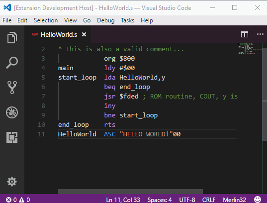

# merlin32 README

Visual Studio Code language extension for 6502 Merlin32 cross-assembler (http://brutaldeluxe.fr/products/crossdevtools/merlin/index.html).

Provides the ability to develop 6502 assembly programs within a modern IDE.

## Features

* Syntax coloring
* Statement completion
* Opcodes tooltip

## Requirements

N/A

## Extension Settings

Not yet, but coming in a future update, to hold settings such as Merlin32 executable path, and emulator path as well (see `future` branch for a working prototype).

## Known Issues

 This is work in progress...

## Release Notes

### 1.0.0

Initial release.

